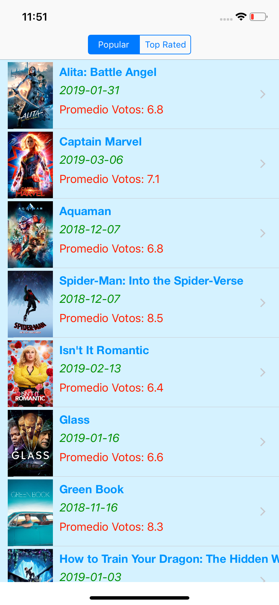
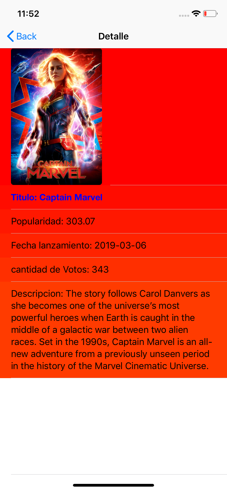

# PeliculaAppSwift
app developed in Swift 4.2, with MIT license

App para ios que muestra las peliculas ordenadas por Top votaciones y otra seccion peliculas ordenado por Popular, al dar click puede entrar al detalle de la pelicula con informacion del titulo, fecha de estreno, popularidad, cantidad de votacion y ademas una descripcion de la pelicula, se utlizaron Webservices Json , hecho en Swift 3 puro.

